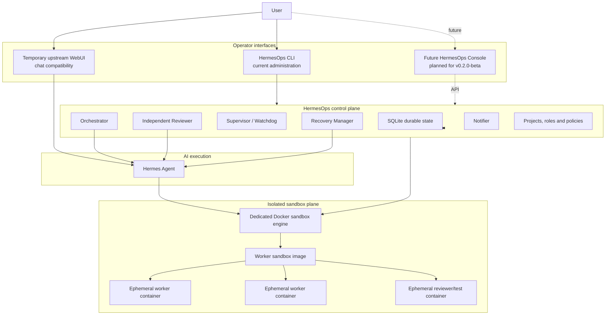

# HermesOps

> **Current status: `v0.1.0-alpha` — foundation release**
>
> HermesOps is usable and its public installation lifecycle has been validated
> on a fresh Debian 12 amd64 system. However, this release is intentionally a
> technical foundation for the project that follows. It is not yet the final
> end-user product, and daily operation is not yet WebUI-only.

HermesOps is an independent, open-source orchestration and project automation
platform built around [Hermes Agent](https://github.com/NousResearch/hermes-agent).

Hermes Agent remains the upstream AI execution engine. HermesOps adds the
control plane required to structure ambitious projects, decompose durable
objectives, run isolated workers, obtain independent reviews, recover from
failures, preserve project memory, and continue long-running work safely.

The long-term goal is not merely “an AI agent that writes code.” HermesOps aims
to become a local project operations platform combining concepts commonly
found in CI systems, project trackers, orchestration engines, recovery systems,
and AI technical leadership.

## Release direction

### `v0.1.0-alpha` — the foundation available today

The current release provides:

- a persistent SQLite control plane;
- durable projects, objectives, plans, tasks, runs, reviews, and notifications;
- logical orchestrator, worker, reviewer, and recovery roles;
- isolated worker execution through a dedicated Docker engine;
- Git snapshots and transactional integration rules;
- independent review before integration;
- automatic supervisor, orchestrator, and notifier services;
- restart persistence through user-level systemd services;
- a reproducible prebuilt worker sandbox image;
- public preflight, installation, validation, and conservative uninstall tools;
- a temporary compatibility WebUI supplied by the upstream Hermes ecosystem.

This version is the stable base on which the actual HermesOps user experience
will be built. Some configuration and operational actions still require the
terminal.

### `v0.2.0-beta` — long-term product milestone

`v0.2.0-beta` is planned as a major, long-term milestone.
It has no committed release date and will require substantial development time.

The target includes:

- **HermesOps Console**, a dedicated WebUI developed specifically for
  HermesOps;
- WebUI-first project creation, objective submission, monitoring, review,
  recovery, backup, and configuration;
- functional, editable **Hermesfiles** for defining sandbox environments;
- validation, build, test, activation, versioning, and rollback of sandbox
  profiles from the WebUI;
- automatic retrieval of the official default worker image;
- multiple sandbox profiles selectable per project or role;
- richer live run views, resource monitoring, memory, decisions, and audit
  history.

Until that milestone exists, the current upstream WebUI must be understood as a
temporary compatibility interface, not as the final HermesOps Console.

## What HermesOps is

HermesOps is both:

1. an add-on control plane around Hermes Agent; and
2. a structured operating model for ambitious, long-running projects.

A project in HermesOps is more than a directory. It can accumulate:

- vision and constraints;
- architectural decisions;
- roadmaps and milestones;
- durable objectives and task dependencies;
- specialized worker runs;
- independent review results;
- recovery decisions;
- project memory and operational history;
- backups and transaction snapshots;
- notification and approval state.

A typical lifecycle is:

```text
User objective
    ↓
Orchestrator planning
    ↓
Persistent DAG of tasks
    ↓
Specialized worker executions
    ↓
Tests and produced commit
    ↓
Independent read-only review
    ↓
Integrate, fix, recover, or request human input
    ↓
Update durable state, memory, and backlog
```

## Architecture



### Control plane and sandbox plane

The **control plane** decides what should happen:

- which project and objective are active;
- how work is decomposed;
- which role handles each task;
- whether a result may be integrated;
- whether a failed run can be resumed or rolled back;
- what must be persisted, audited, or reported.

The **sandbox plane** provides isolated Linux environments where commands and
project work are executed.

These are deliberately separate. The worker image does not contain the
orchestration architecture. Orchestrator, worker, reviewer, and recovery are
logical HermesOps roles defined by configuration and controller state.

## Components

| Component | Purpose |
| --- | --- |
| Hermes Agent | Upstream AI gateway and agent execution engine |
| HermesOps controller scripts | Durable objectives, orchestration, transactions, reviews, recovery, registry, and operator commands |
| SQLite control database | Persistent project and run state |
| `hermesops-supervisor` | Watchdog, stale-run detection, health checks, and recovery triggers |
| `hermesops-orchestrator` | Persistent planning and DAG task execution |
| `hermesops-notifier` | Durable notification outbox delivery |
| Sandbox engine | Dedicated nested Docker daemon used only for isolated execution |
| Worker image | Reproducible template from which temporary work containers are created |
| Temporary upstream WebUI | Current compatibility interface on `127.0.0.1:8787` |
| Future HermesOps Console | Dedicated HermesOps WebUI planned for `v0.2.0-beta` |

## Roles

The default logical roles are:

| Role | Responsibility |
| --- | --- |
| `ops-orchestrator` | Understand objectives, create plans, manage dependencies, and choose the next safe work |
| `ops-worker-code` | Implement code changes in an isolated writable workspace |
| `ops-worker-tests` | Create or run tests and validation tasks |
| `ops-worker-docs` | Produce and maintain project documentation |
| `ops-reviewer` | Independently inspect results with a read-only project view |
| `ops-recovery` | Diagnose interrupted or inconsistent runs and choose a safe recovery path |

The allowed recovery decisions are intentionally limited to:

```text
RESUME_SAFE
ROLLBACK_SAFE
BLOCK_HUMAN
```

The reviewer can return more nuanced outcomes, including:

```text
PASS
PASS_WITH_DEBT
FIX
SECURITY
PERFORMANCE
ARCHITECTURE
HUMAN
```

A transport failure is never treated as an approval.

## Worker image, archive, engine, and containers

These terms describe different things.

```text
hermesops-worker-sandbox-0.2.tar.gz
        ↓ imported as
hermesops-worker-sandbox:0.2
        ↓ stored inside
hermesops-sandbox-engine
        ↓ used to create
one or more temporary worker containers
```

### Worker image

`hermesops-worker-sandbox:0.2` is a reusable Docker image containing the Linux
tools expected by the current worker implementation.

It is comparable to a machine template. It is not a running worker and it does
not define the orchestrator/reviewer/recovery architecture.

### Worker archive

The release asset:

```text
hermesops-worker-sandbox-0.2.tar.gz
```

is a compressed export of that Docker image. Its checksum file is:

```text
hermesops-worker-sandbox-0.2.tar.gz.sha256
```

The archive exists so every `v0.1.0-alpha` installation can import the exact
worker image that was tested for the release, without rebuilding it from
mutable package repositories.

It contains no project workspace, HermesOps database, `auth.json`, API key, or
operator secret.

### Sandbox engine

`hermesops-sandbox-engine` is a dedicated Docker daemon running separately from
the host Docker daemon. HermesOps imports the worker image into this isolated
engine and asks it to create temporary work containers.

Workers do not receive the host Docker socket.

### Worker containers

A worker container is one running instance created from the worker image for a
specific execution. One image can create many containers, sequentially or
concurrently.

The practical concurrency limit depends on:

- HermesOps policy;
- CPU and memory;
- disk and I/O capacity;
- the number of safe simultaneous writers;
- whether tasks touch the same repository state.

The default policy allows only one writer per project while permitting limited
parallel read-oriented work.

## Hermesfile v1 — validation and canonicalization available

A **Hermesfile** is one declarative YAML source describing a sandbox profile,
not a project or orchestration plan.

Hermesfile v1 uses:

```yaml
apiVersion: hermesops.dev/v1
kind: SandboxProfile
```

It defines the pinned base image, declarative package inputs, workspace
identity, resource bounds, network declaration, mandatory security invariants,
logical mounts and validation commands.

The current development tree can strictly parse, validate, canonicalize and
fingerprint Hermesfile v1 sources:

```bash
scripts/hermesops-hermesfile.py validate Hermesfile
scripts/hermesops-hermesfile.py fingerprint Hermesfile --json
scripts/hermesops-hermesfile.py canonicalize Hermesfile
```

Validation rejects duplicate YAML keys, aliases, unknown fields, secret-like
values, shell pass-through, protected or overlapping mount paths, privileged
mode, added capabilities, Docker socket access and device access.

Source formatting and comments do not change the canonical digest. The source
digest and canonical digest are both retained.

Image build, package resolution, validation-container execution, profile
activation, rollback and the Console editor remain planned for `v0.2.0-beta`.
A Hermesfile still compiles to an immutable container image internally; it does
not replace images at runtime.

## Security model

HermesOps follows several non-negotiable rules:

- host Docker socket is not mounted into agents or workers;
- project writes happen in isolated clones or worktrees;
- workers do not write directly to `main` or `master`;
- snapshots are required before write transactions;
- completion requires a commit and a clean worktree;
- integration requires independent approval;
- the reviewer receives a read-only project view;
- secrets are not passed to workers or reviewers by default;
- automatic Git push is disabled;
- CPU, memory, PID, timeout, and network policies are configurable;
- unknown recovery states require human intervention;
- `auth.json`, local environment files, SQLite databases, and project
  registrations remain outside Git.

HermesOps reduces operational risk, but an alpha release is not a security
certification. Operators remain responsible for host hardening, network access,
secrets, backups, model-provider credentials, and reviewing project policies.

See also:

- [`docs/SECURITY.md`](docs/SECURITY.md)
- [`docs/POLICIES.md`](docs/POLICIES.md)
- [`docs/RECOVERY.md`](docs/RECOVERY.md)
- [`docs/TRANSACTIONS.md`](docs/TRANSACTIONS.md)

## Requirements

### Supported platform for `v0.1.0-alpha`

- Debian 12 Bookworm;
- amd64;
- a normal user with UID/GID `1000:1000`;
- `sudo` access;
- membership in the `docker` group;
- user-level systemd and linger;
- Docker Engine;
- Docker Compose plugin;
- Internet access for the pinned upstream container images.

The validated public installation used Docker Engine `29.6.1` and Docker
Compose `5.3.x`.

Recommended minimum for evaluation:

- 4 CPU cores;
- 8 GiB RAM;
- 50 GiB free storage.

Real project requirements can be significantly higher.

### Network exposure

The current services bind only to loopback:

| Service | Address |
| --- | --- |
| Hermes Agent health/API gateway | `127.0.0.1:8642` |
| Temporary upstream WebUI | `127.0.0.1:8787` |

Use an SSH tunnel instead of exposing these ports directly.

## Installation

### 1. Install Docker

Install Docker Engine and the Docker Compose plugin from Docker's official
Debian repository, then verify:

```bash
docker version
docker compose version
docker run --rm hello-world
```

The user running HermesOps must be able to use Docker without `sudo`.

### 2. Download the source and worker release assets

Clone the matching release:

```bash
git clone https://github.com/Bebet0o/HermesOps.git
cd HermesOps
git checkout v0.1.0-alpha
```

Download these assets from the same GitHub release into the user's home
directory:

```text
hermesops-worker-sandbox-0.2.tar.gz
hermesops-worker-sandbox-0.2.tar.gz.sha256
```

Verify the archive:

```bash
cd "$HOME"
sha256sum -c hermesops-worker-sandbox-0.2.tar.gz.sha256
```

Return to the repository:

```bash
cd "$HOME/HermesOps"
```

### 3. Run the preflight

```bash
./preflight.sh
```

A successful result ends with:

```text
HERMESOPS_PREFLIGHT_PASS
```

Warnings about dependencies that `install.sh` can install are acceptable.

### 4. Install

```bash
./install.sh \
  --user "$USER" \
  --worker-image-archive \
  "$HOME/hermesops-worker-sandbox-0.2.tar.gz"
```

A successful result ends with:

```text
HERMESOPS_INSTALL_PASS
```

The default root is:

```text
/opt/docker/hermesops
```

The main directories are:

```text
/opt/docker/hermesops/repo
/opt/docker/hermesops/state
/opt/docker/hermesops/secrets
/opt/docker/hermesops/workspaces
/opt/docker/hermesops/project-data
/opt/docker/hermesops/backups
/opt/docker/hermesops/logs
/opt/docker/hermesops/runtime
```

### 5. Installation without AI authentication

`auth.json` is optional during installation. Without it:

- the infrastructure, database, containers, and systemd services are installed;
- the public registry starts with zero projects;
- AI objectives remain unavailable until authentication is configured.

This supported deferred state is useful for validating the public installation
before adding private credentials.

## Authentication

Never commit, print, or share `auth.json`.

Place an existing Hermes Agent authentication file at:

```text
/opt/docker/hermesops/state/hermes-home/auth.json
```

Protect it:

```bash
chmod 0600 \
  /opt/docker/hermesops/state/hermes-home/auth.json
```

Then restart the Agent and verify the role profiles:

```bash
docker restart hermesops-agent

HERMESOPS_ROOT=/opt/docker/hermesops \
  /opt/docker/hermesops/repo/scripts/hermesops-roles.py \
  verify-profiles
```

Provider-specific authentication procedures remain the responsibility of
Hermes Agent and the selected model provider.

## Accessing the current WebUI

The current WebUI is temporary and comes from the upstream Hermes ecosystem.
It is not the future HermesOps Console.

From the operator workstation:

```bash
ssh \
  -L 8787:127.0.0.1:8787 \
  -L 8642:127.0.0.1:8642 \
  user@server
```

Open:

```text
http://127.0.0.1:8787
```

Health endpoints:

```bash
curl --fail http://127.0.0.1:8642/health
curl --fail http://127.0.0.1:8787/health
```

## Registering a project

Create the workspace and data paths:

```bash
mkdir -p \
  /opt/docker/hermesops/workspaces/my-project \
  /opt/docker/hermesops/project-data/my-project
```

Clone or initialize the project repository inside the workspace. Do not make
HermesOps operate directly on an irreplaceable original copy.

Create a local project configuration:

```bash
cd /opt/docker/hermesops/repo

cp \
  config/examples/project.example.toml \
  config/projects.d/my-project.toml
```

Edit the local file and set at least:

```toml
schema_version = 1

[project]
id = "my-project"
name = "My Project"
enabled = true

[paths]
repo = "/opt/docker/hermesops/workspaces/my-project"
data = "/opt/docker/hermesops/project-data/my-project"

[policy]
id = "default"
```

Local files under `config/projects.d/*.toml` are ignored by Git.

Validate and synchronize:

```bash
/opt/docker/hermesops/repo/scripts/hermesops-registry.py validate
/opt/docker/hermesops/repo/scripts/hermesops-registry.py sync
/opt/docker/hermesops/repo/scripts/hermesops-registry.py list
```

## Operating HermesOps today

Daily operation is not yet fully WebUI-based.

Discover the operator commands:

```bash
/opt/docker/hermesops/repo/scripts/hermesopsctl --help
```

Useful status commands include:

```bash
/opt/docker/hermesops/repo/scripts/hermesopsctl queue --active

/opt/docker/hermesops/repo/scripts/hermesops-orchestrator.py \
  daemon-status

/opt/docker/hermesops/repo/scripts/hermesops-supervisor.py \
  status

/opt/docker/hermesops/repo/scripts/hermesops-notifier.py \
  status
```

Before submitting a real objective, inspect the exact CLI contract shipped by
the installed version:

```bash
/opt/docker/hermesops/repo/scripts/hermesopsctl submit --help
```

This avoids copying flags from a different release.

## Runtime verification

Containers:

```bash
docker ps --format \
  'table {{.Names}}\t{{.Status}}\t{{.Ports}}'
```

User services:

```bash
systemctl --user is-active \
  hermesops-supervisor.service \
  hermesops-orchestrator.service \
  hermesops-notifier.service
```

Full runtime validation with configured authentication:

```bash
cd /opt/docker/hermesops/repo
./validate.sh --runtime
```

Worker image inside the isolated sandbox engine:

```bash
docker exec hermesops-sandbox-engine \
  docker image inspect \
  hermesops-worker-sandbox:0.2 \
  --format 'id={{.Id}}'
```

## Persistence

The public installation has been exercised through:

```text
preflight
→ installation
→ complete host reboot
→ automatic container recovery
→ automatic user-service recovery
→ health verification
→ worker image persistence
→ conservative uninstall
```

User-level linger is required so the three HermesOps services can start without
an interactive login.

## Backups and state

Important persistent paths:

```text
/opt/docker/hermesops/state/controller/hermesops.db
/opt/docker/hermesops/state/hermes-home
/opt/docker/hermesops/secrets
/opt/docker/hermesops/workspaces
/opt/docker/hermesops/project-data
/opt/docker/hermesops/backups
```

Example manual database backup:

```bash
mkdir -p /opt/docker/hermesops/backups

sqlite3 \
  /opt/docker/hermesops/state/controller/hermesops.db \
  ".backup '/opt/docker/hermesops/backups/controller-manual.sqlite'"
```

Example infrastructure Git bundle:

```bash
git -C /opt/docker/hermesops/repo \
  bundle create \
  /opt/docker/hermesops/backups/hermesops-manual.bundle \
  --all
```

Project repositories and external project data require their own backup policy.

## Conservative uninstall

From the source tree:

```bash
./uninstall.sh --user "$USER"
```

The conservative uninstall:

- stops and removes HermesOps containers;
- disables and removes HermesOps user systemd units;
- preserves the installed repository;
- preserves SQLite state;
- preserves secrets;
- preserves workspaces and project data;
- preserves backups.

Review `./uninstall.sh --help` before requesting destructive removal.

## Current limitations

`v0.1.0-alpha` is a foundation release. Important limitations include:

- the dedicated HermesOps Console does not exist yet;
- the current WebUI is a temporary upstream compatibility interface;
- project and objective administration still uses CLI tools;
- sandbox profiles cannot yet be edited in the WebUI;
- Hermesfile v1 validation and canonicalization are implemented, but image build, activation and rollback are not yet available;
- the default worker image must be imported from a release archive;
- custom worker images are not yet a supported first-class workflow;
- public installation currently targets Debian 12 amd64 only;
- installation currently assumes UID/GID `1000:1000`;
- high worker concurrency has not been validated as a public release target;
- operators must still understand Git, Docker, systemd, and recovery policy;
- this alpha should be evaluated on disposable or well-backed-up projects
  before production use.

## Roadmap

### `v0.1.0-alpha`

- publish the validated foundation;
- provide the source release and worker image asset;
- document installation, architecture, security, and limitations;
- gather real installation feedback.

### `v0.2.0-beta` — long-term, no committed date

- HermesOps Controller API;
- dedicated HermesOps Console;
- WebUI-first daily operation;
- Hermesfile-backed image build, validation, activation, versioning and rollback;
- sandbox profile editor;
- build, validation, test, activation, and rollback workflows;
- automatic official worker-image retrieval;
- multiple versioned sandbox profiles;
- project creation and onboarding from the WebUI;
- objective, task, review, recovery, memory, and backup views;
- structured audit log and role/model configuration.

Later milestones may expand multi-project scheduling, notifications, provider
adapters, distributed workers, richer project memory, and advanced resource
management.

### Development contracts

The first `v0.2.0-beta` architecture contracts are maintained in:

- [`docs/V020_BETA_ARCHITECTURE.md`](docs/V020_BETA_ARCHITECTURE.md)

They define the future Controller API, event stream, Console boundary,
Hermesfile schema, sandbox-management rules, and accepted architecture
decisions. They are design contracts and do not mean those runtime features are
already implemented.

## Relationship with Hermes Agent

HermesOps does not replace Hermes Agent.

```text
Hermes Agent
= upstream AI execution engine

HermesOps
= project orchestration, safety, persistence, isolation, review, recovery,
  automation, and the future dedicated WebUI
```

HermesOps should remain sufficiently separated from Hermes Agent that upstream
Agent updates can be adopted without rewriting the HermesOps control plane.

## Contributing

The project is early and interfaces may change.

Before contributing:

```bash
./preflight.sh
./validate.sh --static
```

Do not include:

- `auth.json`;
- real `.env` files;
- secrets;
- private project registrations;
- SQLite databases;
- project workspaces;
- generated runtime state.

Security-sensitive findings should not be placed in a public issue with
reproduction secrets. See [`SECURITY.md`](SECURITY.md).

## License

HermesOps is licensed under the **Apache License 2.0**.

See [`LICENSE`](LICENSE).

Third-party components, including Hermes Agent and the temporary upstream
WebUI, retain their own licenses and copyrights.
