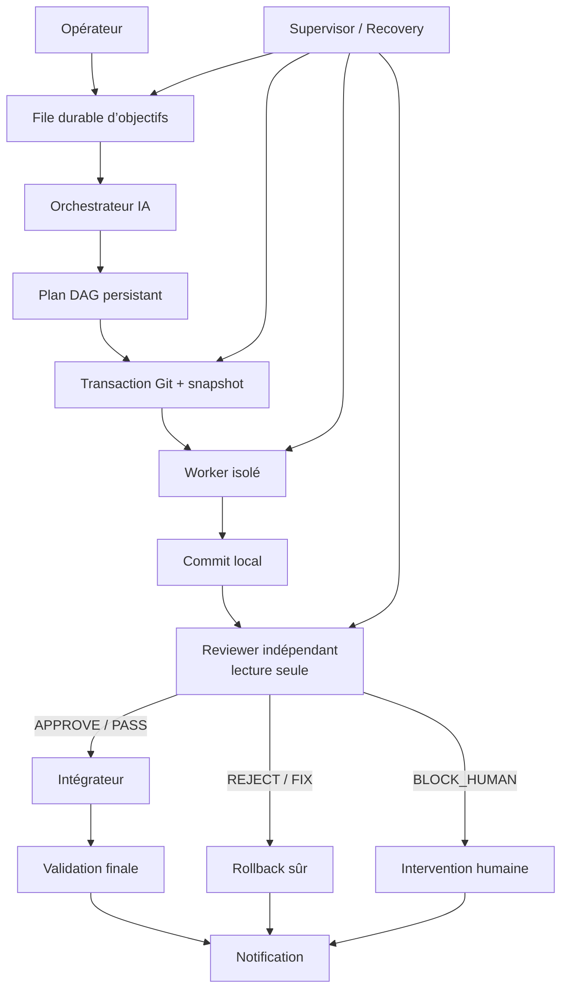

# HermesOps

HermesOps est un contrôleur local d’agents IA pour exécuter des travaux de développement logiciel de manière **persistante, isolée, révisée et récupérable**.

Au lieu de donner directement un dépôt à un agent unique, HermesOps sépare les responsabilités :

- un **orchestrateur** transforme un objectif en plan ;
- des **workers** travaillent dans des clones ou worktrees isolés ;
- un **reviewer indépendant** vérifie le commit en lecture seule ;
- un **intégrateur** applique uniquement les résultats approuvés ;
- un **Recovery Manager** choisit entre `RESUME_SAFE`, `ROLLBACK_SAFE` et `BLOCK_HUMAN` ;
- un **superviseur** surveille les services, les verrous et les travaux abandonnés ;
- un **notifier** envoie les événements importants, notamment sur Telegram.

> **État du projet : alpha fonctionnelle.**
> Le pipeline complet a été validé sur un vrai dépôt : planification IA, worker isolé, commit local, revue indépendante, intégration transactionnelle, revalidation et notification Telegram.

---

## Ce qui fonctionne aujourd’hui

- registre déclaratif multi-projets ;
- état persistant dans SQLite avec journal WAL ;
- file durable d’objectifs ;
- planification IA en DAG ;
- workers spécialisés code, tests et documentation ;
- worktrees Git transactionnels avec snapshot préalable ;
- sandboxes Docker dédiées sans accès au Docker de l’hôte ;
- réseau désactivable par rôle ;
- reviewer indépendant monté en lecture seule ;
- intégration uniquement après verdict favorable ;
- rollback automatique si la revue ou l’intégration échoue ;
- watchdog et récupération après crash ou redémarrage ;
- notifications durables fichier et Telegram ;
- WebUI locale ;
- absence de push automatique ;
- historique complet des objectifs, plans, runs, workers, revues et intégrations.

Le premier objectif réel validé a modifié uniquement un document du projet TradingBot. Le reviewer a approuvé le résultat, l’intégrateur l’a appliqué, puis Pytest et Ruff ont été relancés avec succès.

---

## Architecture



### Conteneurs permanents

| Conteneur | Fonction | Exposition |
|---|---|---|
| `hermesops-agent` | Hermes Agent et gateway | `127.0.0.1:8642` |
| `hermesops-webui` | interface Web | `127.0.0.1:8787` |
| `hermesops-sandbox-engine` | moteur Docker isolé pour workers et reviewers | interne |

### Services utilisateur persistants

```text
hermesops-supervisor.service
hermesops-orchestrator.service
hermesops-notifier.service
```

---

## Modèle de sécurité

HermesOps est conçu pour échouer de manière fermée.

- Les workers n’écrivent jamais directement sur la branche principale.
- Le reviewer ne possède qu’un montage en lecture seule.
- Le push Git est désactivé par défaut.
- Une revue non concluante n’est jamais considérée comme une approbation.
- Une branche principale divergente entraîne un blocage ou un rollback.
- Les secrets ne sont pas montés dans les sandboxes de travail.
- Les sandboxes utilisent notamment :
  - `network_mode: none` lorsque le réseau n’est pas nécessaire ;
  - `cap_drop: ALL` ;
  - `no-new-privileges` ;
  - des limites CPU, mémoire et PID ;
  - un moteur Docker dédié, sans montage de `/var/run/docker.sock`.
- Chaque transaction possède un snapshot Git vérifié avant intégration.

Décisions de récupération autorisées :

```text
RESUME_SAFE
ROLLBACK_SAFE
BLOCK_HUMAN
```

---

## Prérequis

La plateforme validée utilise :

- Debian 12 amd64 ;
- Docker Engine avec le plugin Docker Compose ;
- Git ;
- Python 3.11 ou plus récent ;
- SQLite 3 ;
- `systemd --user` ;
- un compte utilisateur membre du groupe `docker` ;
- un fournisseur compatible avec Hermes Agent ;
- suffisamment d’espace pour les clones, worktrees, images et snapshots.

Pour que les services utilisateur survivent à une déconnexion :

```bash
sudo loginctl enable-linger "$USER"
```

---

## Installation

### Important avant une installation publique

L’instance actuelle est pleinement fonctionnelle, mais elle a été construite et validée par jalons. Le dépôt contient le runtime, les migrations, les tests, les unités systemd et les fichiers Compose, mais le **bootstrap public en une seule commande n’est pas encore consolidé**.

Avant d’annoncer une installation « clone and run », il reste à publier un `install.sh` idempotent qui :

1. crée l’arborescence ;
2. initialise la base et applique les migrations ;
3. installe les profils Hermes ;
4. installe les unités systemd utilisateur ;
5. vérifie les secrets et l’authentification ;
6. lance les tests de fondation.

Les instructions ci-dessous correspondent à l’installation alpha actuellement validée.

### 1. Installer les dépendances système

Installez Docker Engine, Docker Compose, Git, Python 3, SQLite et les utilitaires usuels selon votre distribution.

Vérification :

```bash
docker version
docker compose version
git --version
python3 --version
sqlite3 --version
```

### 2. Préparer l’arborescence

```bash
export HERMESOPS_ROOT=/opt/docker/hermesops

sudo install -d -m 0750 -o "$USER" -g "$USER" \
  "$HERMESOPS_ROOT" \
  "$HERMESOPS_ROOT/state" \
  "$HERMESOPS_ROOT/state/controller" \
  "$HERMESOPS_ROOT/state/hermes-home" \
  "$HERMESOPS_ROOT/state/sandboxes" \
  "$HERMESOPS_ROOT/runtime" \
  "$HERMESOPS_ROOT/workspaces" \
  "$HERMESOPS_ROOT/project-data" \
  "$HERMESOPS_ROOT/backups" \
  "$HERMESOPS_ROOT/secrets"
```

### 3. Cloner HermesOps

```bash
git clone https://github.com/VOTRE_COMPTE/HermesOps.git \
  /opt/docker/hermesops/repo

cd /opt/docker/hermesops/repo
```

### 4. Configurer les secrets

Les éléments suivants ne doivent jamais être versionnés :

```text
/opt/docker/hermesops/state/hermes-home/auth.json
/opt/docker/hermesops/secrets/*.env
/opt/docker/hermesops/state/controller/hermesops.db
```

Permissions recommandées :

```bash
chmod 0700 /opt/docker/hermesops/secrets
chmod 0600 /opt/docker/hermesops/state/hermes-home/auth.json
chmod 0600 /opt/docker/hermesops/secrets/*.env
```

La configuration WebUI validée utilise notamment :

```text
HERMES_WEBUI_PASSWORD
HERMES_WEBUI_GATEWAY_API_KEY
HERMES_WEBUI_GATEWAY_BASE_URL
HERMES_WEBUI_CHAT_BACKEND
```

Telegram est optionnel. Les identifiants du bot et du chat doivent rester dans :

```text
/opt/docker/hermesops/secrets/notifications.env
```

### 5. Démarrer la plateforme Docker

```bash
docker compose \
  --project-directory /opt/docker/hermesops/repo/compose \
  --env-file /opt/docker/hermesops/repo/compose/images.lock.env \
  -f /opt/docker/hermesops/repo/compose/agent.yaml \
  up -d
```

Vérification :

```bash
docker compose \
  --project-directory /opt/docker/hermesops/repo/compose \
  --env-file /opt/docker/hermesops/repo/compose/images.lock.env \
  -f /opt/docker/hermesops/repo/compose/agent.yaml \
  ps
```

Tests de santé :

```bash
curl --fail http://127.0.0.1:8642/health
curl --fail http://127.0.0.1:8787/health

docker exec hermesops-sandbox-engine \
  docker info --format \
  'Server={{.ServerVersion}} Containers={{.Containers}} Images={{.Images}}'
```

### 6. Installer les services utilisateur

```bash
install -d -m 0750 "$HOME/.config/systemd/user"

install -m 0644 \
  /opt/docker/hermesops/repo/systemd/user/hermesops-supervisor.service \
  /opt/docker/hermesops/repo/systemd/user/hermesops-orchestrator.service \
  /opt/docker/hermesops/repo/systemd/user/hermesops-notifier.service \
  "$HOME/.config/systemd/user/"

systemctl --user daemon-reload

systemctl --user enable --now \
  hermesops-supervisor.service \
  hermesops-orchestrator.service \
  hermesops-notifier.service
```

Vérification :

```bash
systemctl --user is-active hermesops-supervisor.service
systemctl --user is-active hermesops-orchestrator.service
systemctl --user is-active hermesops-notifier.service
```

### 7. Initialiser et valider le contrôleur

Sur une installation déjà migrée :

```bash
/opt/docker/hermesops/repo/scripts/hermesops-registry.py validate
/opt/docker/hermesops/repo/scripts/hermesops-registry.py sync
```

Vérification de la base :

```bash
sqlite3 /opt/docker/hermesops/state/controller/hermesops.db \
  'PRAGMA quick_check;'

sqlite3 /opt/docker/hermesops/state/controller/hermesops.db \
  'PRAGMA foreign_key_check;'

sqlite3 /opt/docker/hermesops/state/controller/hermesops.db \
  'PRAGMA journal_mode;'
```

Résultats attendus :

```text
ok
<aucune ligne pour foreign_key_check>
wal
```

---

## Accéder à la WebUI

La WebUI écoute uniquement sur localhost.

Depuis une autre machine :

```bash
ssh -L 8787:127.0.0.1:8787 utilisateur@serveur
```

Ouvrez ensuite :

```text
http://127.0.0.1:8787
```

Le port `8642` du gateway peut être tunnelé de la même manière si nécessaire.

---

## Enregistrer un projet

### 1. Préparer le dépôt

Exemple :

```bash
git clone URL_DU_PROJET \
  /opt/docker/hermesops/workspaces/mon-projet

install -d -m 0750 \
  /opt/docker/hermesops/project-data/mon-projet
```

Le dépôt doit être propre :

```bash
git -C /opt/docker/hermesops/workspaces/mon-projet \
  status --short --branch
```

Désactivation recommandée du push :

```bash
git -C /opt/docker/hermesops/workspaces/mon-projet \
  config remote.origin.pushurl disabled://

git -C /opt/docker/hermesops/workspaces/mon-projet \
  config push.default nothing
```

### 2. Créer la configuration projet

Créez :

```text
config/projects.d/mon-projet.toml
```

Exemple :

```toml
schema_version = 1

[project]
id = "mon-projet"
name = "Mon Projet"
enabled = true
policy = "default"

[paths]
repo = "/opt/docker/hermesops/workspaces/mon-projet"
data = "/opt/docker/hermesops/project-data/mon-projet"

[git]
default_branch = "main"
allow_push = false
require_clean = true

[execution]
writer_concurrency = 1
max_parallel_tasks = 2

[review]
required = true
```

### 3. Synchroniser le registre

```bash
cd /opt/docker/hermesops/repo

scripts/hermesops-registry.py validate
scripts/hermesops-registry.py sync
```

Lister les projets enregistrés :

```bash
sqlite3 -header -column \
  /opt/docker/hermesops/state/controller/hermesops.db \
  'SELECT project_id, display_name, enabled, repo_path, data_path, policy_id
   FROM projects
   ORDER BY project_id;'
```

---

## Utilisation quotidienne

### 1. Écrire un objectif

Un bon objectif doit être borné et vérifiable.

Exemple :

```bash
cat > "$HOME/objective.md" <<'EOF'
Travaille uniquement dans le projet mon-projet.

But :
ajouter une documentation sur le système de sauvegarde.

Périmètre autorisé :
- docs/backup.md
- README.md

Interdictions :
- ne pas modifier src/
- ne pas modifier les dépendances
- ne pas accéder aux secrets
- ne pas pousser

Validation :
- git diff --check
- tests hors ligne du projet
- exactement un commit local
- revue indépendante obligatoire
EOF
```

Précisez toujours :

- le projet ;
- le résultat attendu ;
- les chemins autorisés ;
- les chemins interdits ;
- les commandes de validation ;
- le nombre ou le sujet de commit attendu ;
- les accès réseau ou secrets interdits ;
- les critères d’acceptation.

### 2. Soumettre l’objectif

```bash
RESULT="$(
  /opt/docker/hermesops/repo/scripts/hermesops-control.py submit \
    --project mon-projet \
    --file "$HOME/objective.md" \
    --priority 10 \
    --max-parallel 1 \
    --planning-attempts 3
)"

printf '%s\n' "$RESULT"
```

Récupérer l’identifiant :

```bash
OBJECTIVE_ID="$(
  python3 -c \
    'import json,sys; print(json.load(sys.stdin)["objective"]["objective_id"])' \
    <<<"$RESULT"
)"

echo "$OBJECTIVE_ID"
```

### 3. Suivre l’objectif

```bash
/opt/docker/hermesops/repo/scripts/hermesopsctl \
  show "$OBJECTIVE_ID"
```

Journaux de l’orchestrateur :

```bash
journalctl --user \
  -u hermesops-orchestrator.service \
  -f
```

Journaux du notifier :

```bash
journalctl --user \
  -u hermesops-notifier.service \
  -f
```

### 4. Comprendre les états

Cycle normal :

```text
QUEUED
  → PLANNING
  → RUNNING
  → COMPLETED
```

États possibles en cas de problème :

```text
FAILED
CANCELLED
PAUSED
BLOCKED
```

Un objectif `FAILED` ne signifie pas nécessairement que le système est cassé. Il peut signifier que le reviewer a correctement refusé un commit. Dans ce cas, la branche principale reste inchangée et la transaction est annulée.

---

## Ce que fait HermesOps après la soumission

1. L’objectif est écrit dans la base.
2. L’orchestrateur IA construit un plan.
3. Le plan est enregistré avant exécution.
4. Une transaction Git prend un snapshot.
5. Un worker reçoit un clone ou worktree isolé.
6. Le worker produit un commit local.
7. Un reviewer séparé inspecte le commit en lecture seule.
8. L’intégrateur vérifie :
   - le snapshot ;
   - la base du commit ;
   - l’actualité de la revue ;
   - la propreté de la branche principale ;
   - le verdict.
9. Le commit est intégré uniquement avec `APPROVE / PASS`.
10. Le projet est revalidé.
11. Telegram et l’outbox durable reçoivent le résultat.

---

## Diagnostic rapide

### État des conteneurs

```bash
docker ps \
  --format 'table {{.Names}}\t{{.Status}}\t{{.Image}}'
```

### État du superviseur

```bash
/opt/docker/hermesops/repo/scripts/hermesops-supervisor.py \
  status
```

### État de l’orchestrateur

```bash
/opt/docker/hermesops/repo/scripts/hermesops-orchestrator.py \
  daemon-status
```

### État du notifier

```bash
/opt/docker/hermesops/repo/scripts/hermesops-notifier.py \
  status
```

### Travaux actifs

```bash
sqlite3 -header -column \
  /opt/docker/hermesops/state/controller/hermesops.db \
  "
  SELECT COUNT(*) AS active_locks FROM project_locks;

  SELECT COUNT(*) AS active_runs
  FROM runs
  WHERE status NOT IN ('COMPLETED','FAILED','CANCELLED');

  SELECT COUNT(*) AS active_objectives
  FROM objective_queue
  WHERE status NOT IN ('COMPLETED','FAILED','CANCELLED');
  "
```

### Notifications non drainées

```bash
sqlite3 -header -column \
  /opt/docker/hermesops/state/controller/hermesops.db \
  "
  SELECT status, COUNT(*) AS count
  FROM notification_outbox
  GROUP BY status
  ORDER BY status;
  "
```

### Détecter les ressources orphelines

Lecture seule :

```bash
/opt/docker/hermesops/repo/scripts/hermesops-recovery.py \
  cleanup-orphans --dry-run
```

---

## Récupération manuelle

Évaluer un run :

```bash
/opt/docker/hermesops/repo/scripts/hermesops-recovery.py \
  assess --run RUN_ID
```

Appliquer une décision seulement après avoir vérifié le diagnostic :

```bash
/opt/docker/hermesops/repo/scripts/hermesops-recovery.py \
  recover \
  --run RUN_ID \
  --owner operator-manual \
  --expected-decision ROLLBACK_SAFE
```

Ne forcez jamais une décision différente de celle calculée sans comprendre l’état du snapshot, du worktree et de la branche principale.

---

## Sauvegardes

HermesOps conserve notamment :

```text
/opt/docker/hermesops/backups/
/opt/docker/hermesops/backups/transactions/
/opt/docker/hermesops/state/controller/hermesops.db
```

Créer une sauvegarde Git du contrôleur :

```bash
git -C /opt/docker/hermesops/repo \
  bundle create \
  /opt/docker/hermesops/backups/hermesops-manual.bundle \
  --all
```

Sauvegarder SQLite :

```bash
sqlite3 /opt/docker/hermesops/state/controller/hermesops.db \
  ".backup '/opt/docker/hermesops/backups/controller-manual.sqlite'"
```

Vérifier :

```bash
git bundle verify \
  /opt/docker/hermesops/backups/hermesops-manual.bundle

sqlite3 \
  /opt/docker/hermesops/backups/controller-manual.sqlite \
  'PRAGMA quick_check;'
```

---

## Structure du dépôt

```text
compose/              Déploiement Docker et images verrouillées
config/               Contrôleur, rôles, projets et politiques
docs/                 Architecture, état et procédures
migrations/           Migrations SQLite
profiles/             Contrats des rôles Hermes
scripts/              CLI et services du contrôleur
systemd/user/         Services persistants utilisateur
tests/                Tests de fondation et de récupération
VERSION                Version du contrôleur
```

Arborescence runtime :

```text
/opt/docker/hermesops/
├── repo/
├── state/
│   ├── controller/
│   ├── hermes-home/
│   └── sandboxes/
├── runtime/
├── workspaces/
├── project-data/
├── backups/
└── secrets/
```

---

## Limites actuelles

- Le bootstrap propre d’un hôte vierge n’est pas encore regroupé dans un installateur public unique.
- La WebUI n’expose pas encore toutes les fonctions administratives du CLI.
- Les approbations humaines restent principalement pilotées côté contrôleur.
- Les profils et politiques sont encore destinés à des opérateurs techniques.
- La compatibilité hors Debian 12 n’est pas encore validée.
- Aucun push automatique vers un remote n’est autorisé.
- HermesOps reste une alpha : utilisez-le uniquement avec des dépôts sauvegardés.

---

## Prochaine étape du projet

Le moteur n’a plus besoin d’un nouveau jalon fondamental avant d’être utilisé.

La priorité est maintenant la **mise en produit** :

1. créer un installateur idempotent pour hôte vierge ;
2. ajouter des fichiers `.env.example` sans secret ;
3. ajouter un contrôle pré-push contre les secrets et bases SQLite ;
4. ajouter une CI pour les tests de fondation ;
5. documenter l’ajout d’un fournisseur autre qu’OpenAI Codex ;
6. créer une release `0.1.0-alpha` ;
7. seulement ensuite reprendre les fonctions avancées et les nouveaux projets.

---

## Avant de publier sur GitHub

Vérifiez qu’aucun secret ou état runtime n’est suivi :

```bash
cd /opt/docker/hermesops/repo

git status --short

git ls-files |
grep -Ei \
  '(^|/)(auth\.json|secrets?/|.*\.env$|.*\.sqlite$|.*\.db$|controller-validation-evidence\.json$)' \
  && {
    echo "ERREUR : fichier sensible suivi par Git"
    exit 1
  } || true
```

Vérifiez également :

```bash
git grep -nEi \
  '(api[_-]?key|bot[_-]?token|password|secret)[[:space:]]*[:=][[:space:]]*[^<[:space:]]+' \
  -- . \
  ':!README.md' \
  ':!docs/' || true
```

Commit du README :

```bash
git add README.md
git commit -m "docs: add public installation and usage guide"
```

Configurer le remote, seulement s’il n’existe pas :

```bash
git remote add origin \
  git@github.com:VOTRE_COMPTE/HermesOps.git
```

Publication :

```bash
git push -u origin main
```

Le push doit être effectué manuellement par l’opérateur. Les workers HermesOps ne doivent jamais publier le dépôt.
